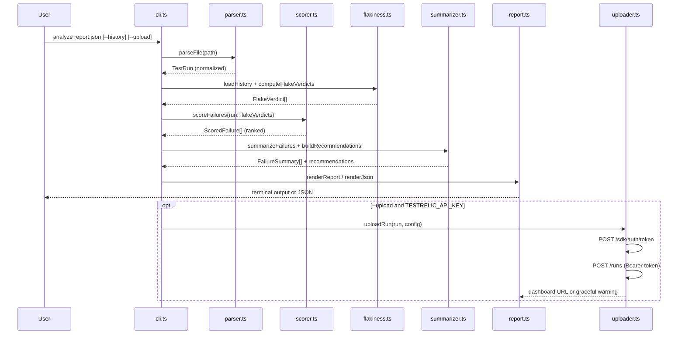
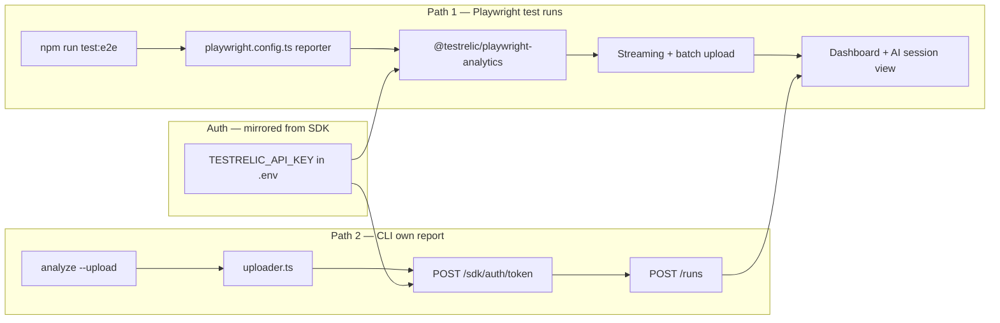

# testrelic-signal

Turn noisy Playwright/CTRF test results into actionable QA intelligence: **which failures are real bugs, which are flaky noise, and what to do next** — for teams with no dedicated QA, in under 15 minutes.

---

## Table of contents

1. [Quick start](#quick-start)
2. [The problem we solve](#the-problem-we-solve)
3. [System architecture](#system-architecture)
4. [CLI pipeline flow](#cli-pipeline-flow)
5. [TestRelic integration flow](#testrelic-integration-flow)
6. [Repository structure — file reference](#repository-structure--file-reference)
7. [CLI usage](#cli-usage)
8. [Running tests](#running-tests)
9. [Deliverables](#deliverables)
10. [TestRelic MCP — known issue & Ask AI fallback](#testrelic-mcp--known-issue--ask-ai-fallback)
11. [Design principles](#design-principles)
12. [Attributions & license](#attributions--license)

---

## Quick start

```bash
git clone https://github.com/vijayshreepathak/testrelic-signal.git && cd testrelic-signal
npm install
npm run analyze
```

`npm run analyze` runs the CLI on bundled fixtures with 5-run history — **instant first value, fully offline, no API key**.

Optional cloud upload:

```bash
cp .env.example .env          # paste TESTRELIC_API_KEY
npm run test:e2e              # Playwright → TestRelic reporter upload
npx tsx src/cli.ts analyze fixtures/ctrf-valid.json --upload
```

---

## The problem we solve

A 12-person SaaS startup runs Playwright in CI. Results land in GitHub Actions artifacts. Nobody reads them. When CI fails:

- A **checkout tax bug** and a **flaky search timeout** look identical (both red).
- Developers block deploys on noise, or ship past real regressions.
- There is **no QA engineer** to triage.

**testrelic-signal** extracts signal at the moment of failure:

| Question | How we answer it |
|----------|------------------|
| Is this a real bug or flake? | History-based flakiness engine with cited evidence |
| What matters most? | Business-impact scoring (checkout > cosmetic) |
| What do I do next? | Four-line plain-English summary per top failure |
| Does it work offline? | Yes — full report without network or API key |

Full diagnosis: [docs/problem.md](docs/problem.md) · Scale playbook: [docs/scale.md](docs/scale.md)

---

## System architecture

High-level view of how the repo fits together: offline CLI core, optional TestRelic cloud layer, and the demo test loop that feeds real data.

```mermaid
flowchart TB
  subgraph inputs [Inputs]
    CTRF[CTRF JSON file]
    PW[Playwright JSON report]
    HIST[History dir — prior runs]
  end

  subgraph cli [testrelic-signal CLI — always works offline]
    PARSER[parser.ts]
    SCORER[scorer.ts]
    FLAKE[flakiness.ts]
    SUM[summarizer.ts]
    RPT[report.ts]
    UP[uploader.ts — optional]
    PARSER --> SCORER --> FLAKE --> SUM --> RPT
    RPT --> UP
  end

  subgraph e2e [Playwright E2E layer]
    DEMO[demo-app/]
    SPECS[tests/e2e/*.spec.ts]
    DEMO --> SPECS
  end

  subgraph testrelic [TestRelic cloud — enhancement only]
    REP[@testrelic/playwright-analytics reporter]
    DASH[platform.testrelic.ai dashboard]
    AI[Ask AI / session inspection]
    REP --> DASH --> AI
  end

  CTRF --> PARSER
  PW --> PARSER
  HIST --> FLAKE
  SPECS --> REP
  SPECS --> PW
  PW --> PARSER
  UP --> DASH
  REP --> DASH
  RPT --> TERM[Terminal / JSON output]
```

### Layer responsibilities

| Layer | Role | Hard dependency on cloud? |
|-------|------|---------------------------|
| **CLI core** | Parse, score, flake-detect, summarize, render | No |
| **CLI uploader** | POST run summary to TestRelic REST | Only with `--upload` + key |
| **E2E + reporter** | Real browser tests → rich failures → dashboard | Only when `TESTRELIC_API_KEY` set |
| **Fixtures** | Offline demo data for `npm run analyze` | No |

---

## CLI pipeline flow

Single command: `testrelic-signal analyze <report.json>`



### Exit codes

| Code | Meaning |
|------|---------|
| `0` | Analysis completed (including failed tests, skipped upload, upload HTTP error) |
| `1` | Fatal input error (bad path, invalid JSON, unknown format) |

Upload failures are **never** exit 1 — the local report is always complete.

---

## TestRelic integration flow

Two **documented** upload paths; neither is required for core CLI value.



| Path | What uploads | Config location |
|------|--------------|-----------------|
| **Reporter** | Full Playwright run (steps, network, artifacts) | `playwright.config.ts` |
| **CLI `--upload`** | Normalized run built by `toTestRelicRun()` | `src/uploader.ts` |

Auth endpoints are **mirrored from** `@testrelic/playwright-analytics` dist source — not invented. The raw API key is exchanged for a short-lived access token before any upload.

---

## Repository structure — file reference

```
testrelic-signal/
├── src/                    # CLI source (TypeScript)
├── tests/
│   ├── cli/                # CLI unit tests (Playwright runner, no browser)
│   └── e2e/                # Browser E2E vs demo-app
├── fixtures/               # Offline sample reports + history
├── demo-app/               # Static SaaS app under test
├── docs/                   # Written deliverables + screenshots
├── scripts/                # Dev helpers
├── .github/workflows/      # CI
├── playwright.config.ts
├── package.json
├── tsconfig.json
└── .env.example
```

### `src/` — CLI pipeline modules

| File | Purpose | Key exports / behavior |
|------|---------|------------------------|
| **`types.ts`** | Single source of truth for all data shapes. Decouples the pipeline from CTRF vs Playwright input formats. | `TestRun`, `TestResult`, `ScoredFailure`, `FlakeVerdict`, `FailureSummary`, `RunSignal`, `SignalError` |
| **`parser.ts`** | Auto-detects CTRF or Playwright JSON by shape (not filename). Missing/null fields → safe defaults, never throw. Malformed JSON → typed `SignalError` with remediation. | `parseFile()`, `parseString()` |
| **`scorer.ts`** | Business-impact model — the differentiator. Scores failed tests 0–100 using keyword regex on name/suite/path/tags. Critical (auth, checkout) ×3; cosmetic ×0.5. History modifiers boost consistent failures, downrank flakes. | `scoreFailures()`, `classify()`, `SEVERITY_WEIGHTS`, `SEVERITY_KEYWORDS` |
| **`flakiness.ts`** | Separates flake from real bug using `--history` dir. Verdicts: `likely-flaky`, `likely-real-bug`, `insufficient-history` (<3 observations). Evidence strings cite actual pass/fail patterns. | `loadHistory()`, `computeFlakeVerdicts()` |
| **`summarizer.ts`** | Four plain-English lines per top failure: what failed, why it matters, flake or real, what to do next. Extracts assertion signal (Expected/Received) without stack dumps. | `summarizeFailures()`, `buildRecommendations()`, `extractErrorSignal()` |
| **`report.ts`** | Founder-friendly terminal output: run summary, top 1–3 failures, flaky candidates, recommendations, status line, upload confirmation. `--json` for CI. | `renderReport()`, `renderJson()` |
| **`uploader.ts`** | Enhancement layer only. Two-step auth (SDK-mirrored): token exchange then POST run. Missing key / HTTP errors → visible warning, exit 0. Never logs full API key. Also exports `toCtrf()` for CTRF portability. | `uploadRun()`, `toTestRelicRun()`, `toCtrf()` |
| **`config.ts`** | Env resolution, `.env` loader (zero-dep), secret redaction for logs. | `loadDotenv()`, `resolveConfig()`, `redactKey()`, `redactSecretsIn()` |
| **`cli.ts`** | Commander orchestration. Single verb: `analyze`. Wires pipeline, handles exit codes, loads `.env` on `--upload`. Exports `buildSignal()` for tests. | `buildProgram()`, `buildSignal()` |

### `tests/cli/` — CLI regression tests (16 tests)

| File | What it guards |
|------|----------------|
| **`parser.spec.ts`** | Valid CTRF totals; missing/null fields don't crash; malformed JSON throws helpful error |
| **`scorer.spec.ts`** | Checkout failure outranks cosmetic; exported weight table |
| **`flakiness.spec.ts`** | Alternating test → `likely-flaky`; consistent checkout → `likely-real-bug`; thin history → `insufficient-history` |
| **`summarizer.spec.ts`** | Four summary elements present; flow name in output; error signal extraction |
| **`uploader.spec.ts`** | Missing key skips gracefully; 401/500 caught not thrown; two-step upload mock; CTRF + native payload builders |

### `tests/e2e/` — Playwright E2E (real TestRelic data source)

| File | Flow | Notes |
|------|------|-------|
| **`auth.spec.ts`** | Login with valid credentials; rejects short password | Uses `@testrelic/playwright-analytics/fixture` |
| **`signup.spec.ts`** | Account creation success message | Onboarding / critical path |
| **`checkout.spec.ts`** | **Intentional failure:** tax omitted from total (`100` vs `108`); free shipping banner | `test.fail()` keeps suite green; failure still ingested by TestRelic |

### `demo-app/` — static app under test

| File | Purpose |
|------|---------|
| **`index.html`** | Landing with nav links |
| **`login.html`** | Email/password form; submit enabled when valid |
| **`signup.html`** | Registration form |
| **`checkout.html`** | Order totals UI (`#order-total`, `#tax`, shipping banner) |
| **`search.html`** | Search input + results |
| **`app.js`** | **Intentional bug:** computes tax but omits it from `#order-total` |
| **`styles.css`** | Minimal card layout |

Served locally by `scripts/serve-demo.js` on port 4173 during E2E.

### `fixtures/` — offline demo data

| File | Purpose |
|------|---------|
| **`ctrf-valid.json`** | Main demo run: 4 passed, 3 failed, 1 flaky — checkout tax bug, flaky search, cosmetic footer |
| **`ctrf-missing-fields.json`** | Robustness: null messages, absent retries, unnamed tests |
| **`ctrf-malformed.json`** | Invalid JSON — CLI must error helpfully |
| **`history/run-001.json` … `run-005.json`** | Five prior runs: checkout fails every time (real bug); search alternates (flake); shipping banner intermittently flaky |

### `docs/` — assignment deliverables

| File | Part | Content |
|------|------|---------|
| **`problem.md`** | Part 1 | Root cause, JTBD, failure modes at scale, success metric |
| **`scale.md`** | Part 4 | Deployment playbook, integration failure patterns, feedback loop, product insight |
| **`SCREENSHOTS.md`** | Part 3 | How to capture dashboard, AI analysis, MCP/Ask AI screenshots |
| **`dashboard.png`** | Part 3 | Real Test Runs view (Run #3, checkout failure visible) |
| **`ai-failure-analysis.png`** | Part 3 | Failed checkout session in TestRelic |
| **`mcp-query.png`** | Part 3 | NL query screenshot (MCP or Ask AI fallback) |

### Root & config files

| File | Purpose |
|------|---------|
| **`playwright.config.ts`** | Two projects: `cli` (no browser) and `e2e` (Chrome locally, Chromium in CI). TestRelic reporter when key present. Loads `.env`. |
| **`package.json`** | Bin `testrelic-signal`, scripts, dependencies |
| **`tsconfig.json`** | Strict TypeScript → `dist/` |
| **`.env.example`** | Template for `TESTRELIC_API_KEY`, `TESTRELIC_PROJECT` |
| **`.github/workflows/ci.yml`** | typecheck → CLI tests → E2E → analyze; optional TestRelic secret |
| **`scripts/serve-demo.js`** | Lightweight static server for demo-app (no `npx serve` download) |

---

## CLI usage

```bash
# Bundled offline demo (default npm script)
npm run analyze

# Analyze a real Playwright report after E2E
npx tsx src/cli.ts analyze test-results/playwright-report.json --history ./fixtures/history

# Machine-readable for CI gates
npx tsx src/cli.ts analyze ./fixtures/ctrf-valid.json --json

# Opt-in cloud upload (reads .env automatically)
npx tsx src/cli.ts analyze ./fixtures/ctrf-valid.json --upload
```

| Flag | Purpose |
|------|---------|
| `--history <dir>` | Prior run JSON files for flake detection (default: `./fixtures/history`) |
| `--upload` | Upload to TestRelic via REST (requires `TESTRELIC_API_KEY` in `.env`) |
| `--json` | Machine-readable JSON output |
| `--no-color` | Plain terminal (no ANSI) |

---

## Running tests

```bash
npm run test          # 16 CLI tests — no browser (~3s)
npm run test:e2e      # 5 E2E tests — system Chrome locally
npm run test:all      # 21 total
npm run build         # compile to dist/ for bin publish
npm run typecheck     # tsc --noEmit
```

**Browser:** Local E2E uses `channel: 'chrome'` (installed Google Chrome). CI uses `playwright install chromium`.

**TestRelic reporter:** Activates when `TESTRELIC_API_KEY` is in `.env`. Without a key, E2E still runs with `list` + JSON reporters.

---

## Deliverables

| Artifact | Link |
|----------|------|
| Part 1 — Problem diagnosis | [docs/problem.md](docs/problem.md) |
| Part 4 — Scale playbook | [docs/scale.md](docs/scale.md) |
| Dashboard screenshot | [docs/dashboard.png](docs/dashboard.png) |
| AI failure analysis | [docs/ai-failure-analysis.png](docs/ai-failure-analysis.png) |
| NL query (MCP or Ask AI) | [docs/mcp-query.png](docs/mcp-query.png) |
| CI workflow | [.github/workflows/ci.yml](.github/workflows/ci.yml) |
| Screenshot guide | [docs/SCREENSHOTS.md](docs/SCREENSHOTS.md) |

---

## TestRelic MCP — known issue & Ask AI fallback

During submission, `@testrelic/mcp` failed to start in Cursor with a **third-party dependency error**, not a project or token misconfiguration:

```text
Error: Cannot find module 'ajv'
Require stack:
  ...ajv-formats/dist/limit.js
  ...ajv-formats/dist/index.js
code: 'MODULE_NOT_FOUND'

Connection failed: MCP error -32000: Connection closed
```

Cursor launches `npx @testrelic/mcp`, but an incomplete npm dependency tree causes the MCP server to crash before startup. This is **not** caused by `TESTRELIC_MCP_TOKEN`, MCP config, or this repo.

**What still works (and is graded):**

- CLI offline + `--upload` to TestRelic
- Playwright E2E with `@testrelic/playwright-analytics` reporter
- Real runs on [platform.testrelic.ai](https://platform.testrelic.ai)
- Dashboard + session-level failure inspection + TestRelic Ask AI

**Acceptable fallback for `docs/mcp-query.png`:** use TestRelic **Ask AI** at [platform.testrelic.ai/ai](https://platform.testrelic.ai/ai):

```text
What is the highest business impact failure in my latest test run?
```

Screenshot prompt + response → save as `docs/mcp-query.png`.

**Optional MCP repair:**

```bash
npm cache clean --force
rmdir /s /q %LOCALAPPDATA%\npm-cache\_npx
```

Restart Cursor, retry `npx @testrelic/mcp`.

---

## Design principles

1. **Offline-first** — Core value works with zero network and zero API key.
2. **Graceful degradation** — Missing key, bad upload, thin history → loud warnings, never silent failure, exit 0.
3. **No invented APIs** — TestRelic reporter options and REST auth mirrored from installed SDK + docs.
4. **Signal over noise** — Business impact ranking + flake detection before any stack trace.
5. **Scope discipline** — One CLI verb (`analyze`), no web UI, no extra commands.
6. **Test what matters** — 16 CLI tests + 5 E2E tests covering real regressions, not trivial asserts.

---

## Attributions & license

- [Commander](https://github.com/tj/commander.js) — CLI parsing (MIT)
- [picocolors](https://github.com/alexeyraspopov/picocolors) — terminal colors (ISC)
- [Playwright](https://playwright.dev/) — test runner (Apache-2.0)
- [@testrelic/playwright-analytics](https://www.npmjs.com/package/@testrelic/playwright-analytics) — reporter & fixture (MIT)
- CTRF schema reference: [ctrf.io](https://ctrf.io)

**License:** MIT
